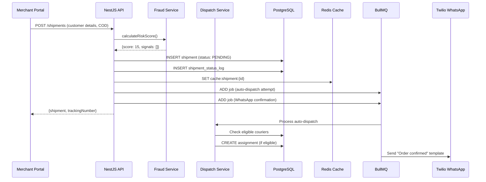
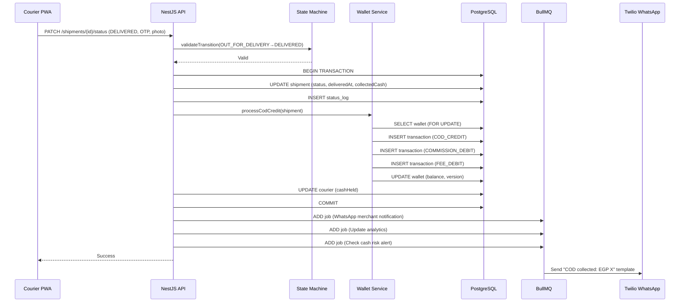

# System Architecture

## Overview

Logistics & COD Shipment Management SaaS built on a **modular monolith** pattern using NestJS. This architecture balances rapid early-stage development with clear boundaries for future microservices extraction.

## Architectural Principles

1. **Domain-Driven Design (DDD):** Modules align with business domains (Shipments, Wallet, Dispatch).
2. **Event-Driven Communication:** Modules communicate via domain events, not direct service calls, ensuring loose coupling.
3. **CQRS-Ready:** Write models (PostgreSQL) are separate from read models (Redis cache, future Elasticsearch).
4. **Financial Integrity:** Wallet transactions use double-entry ledger patterns with optimistic locking.
5. **Offline-First Mobile:** Courier PWA works without connectivity, syncing via Background Sync API.

## High-Level Architecture

```
┌─────────────────────────────────────────────────────────────┐
│                         CLIENTS                              │
│  ┌─────────────┐  ┌─────────────┐  ┌─────────────────────┐ │
│  │Admin React  │  │Merchant     │  │Courier PWA (React)  │ │
│  │Dashboard    │  │Portal       │  │                     │ │
│  └─────────────┘  └─────────────┘  └─────────────────────┘ │
│  ┌─────────────────────────────────────────────────────────┐│
│  │         Public Tracking Page (Next.js / Static)        ││
│  └─────────────────────────────────────────────────────────┘│
└─────────────────────────────────────────────────────────────┘
                              │
                              ▼
┌─────────────────────────────────────────────────────────────┐
│                    LOAD BALANCER (ALB)                       │
│              HTTPS termination, rate limiting                │
└─────────────────────────────────────────────────────────────┘
                              │
                              ▼
┌─────────────────────────────────────────────────────────────┐
│              NESTJS APPLICATION (ECS/EKS/EC2)                │
│  ┌─────────┐ ┌─────────┐ ┌─────────┐ ┌─────────┐ ┌────────┐ │
│  │ Auth    │ │ Users   │ │Merchants│ │ Couriers│ │Shipments│ │
│  │ Module  │ │ Module  │ │ Module  │ │ Module  │ │ Module │ │
│  └─────────┘ └─────────┘ └─────────┘ └─────────┘ └────────┘ │
│  ┌─────────┐ ┌─────────┐ ┌─────────┐ ┌─────────┐ ┌────────┐ │
│  │ Dispatch│ │ Wallet  │ │ Payouts │ │Notificat│ │Tracking│ │
│  │ Module  │ │ Module  │ │ Module  │ │ions Mod │ │ Module │ │
│  └─────────┘ └─────────┘ └─────────┘ └─────────┘ └────────┘ │
│  ┌─────────┐ ┌─────────┐ ┌─────────┐                        │
│  │ Reports │ │Analytics│ │  Core   │                        │
│  │ Module  │ │ Module  │ │(Events, │                        │
│  └─────────┘ └─────────┘ │Config,  │                        │
│                          │Database)│                        │
│                          └─────────┘                        │
└─────────────────────────────────────────────────────────────┘
                              │
           ┌──────────────────┼──────────────────┐
           ▼                  ▼                  ▼
┌─────────────────┐  ┌─────────────────┐  ┌─────────────────┐
│   PostgreSQL    │  │      Redis      │  │   Object Store  │
│   (Primary +    │  │  (Cache +       │  │   (S3-Compatible)│
│    Read Replica)│  │   BullMQ +     │  │                 │
│                 │  │   Sessions)    │  │                 │
└─────────────────┘  └─────────────────┘  └─────────────────┘
                              │
                              ▼
┌─────────────────────────────────────────────────────────────┐
│                    EXTERNAL SERVICES                         │
│  ┌──────────┐  ┌──────────┐  ┌──────────┐  ┌──────────┐   │
│  │ Twilio   │  │  Google  │  │   S3     │  │  Meta    │   │
│  │WhatsApp/ │  │  Maps    │  │ (Files)  │  │  Pixel   │   │
│  │  SMS     │  │(Geocode) │  │          │  │ (Future) │   │
│  └──────────┘  └──────────┘  └──────────┘  └──────────┘   │
└─────────────────────────────────────────────────────────────┘
```

## Module Boundaries

### Auth Module
- **Responsibility:** Authentication, authorization, JWT/OTP issuance, RBAC enforcement.
- **Exposes:** `AuthService`, `JwtAuthGuard`, `RolesGuard`, `PermissionsGuard`.
- **Depends on:** Users Module.
- **Events Emitted:** None (synchronous only).

### Users Module
- **Responsibility:** User CRUD, profile management, phone verification.
- **Exposes:** `UsersService`, `UserRepository`.
- **Depends on:** Core (Prisma).
- **Events Emitted:** `UserCreatedEvent`, `UserPhoneVerifiedEvent`.

### Merchants Module
- **Responsibility:** Merchant onboarding, KYC workflow, fee configuration, branding.
- **Exposes:** `MerchantsService`, `MerchantRepository`, `KycService`.
- **Depends on:** Users Module, Wallet Module (creates wallet on approval).
- **Events Emitted:** `MerchantCreatedEvent`, `MerchantKycApprovedEvent`.

### Couriers Module
- **Responsibility:** Courier CRUD, zone assignment, performance scoring, document management.
- **Exposes:** `CouriersService`, `CourierRepository`, `PerformanceService`.
- **Depends on:** Users Module.
- **Events Emitted:** `CourierCreatedEvent`, `CourierPerformanceUpdatedEvent`.

### Shipments Module
- **Responsibility:** Shipment lifecycle, state machine enforcement, status logging.
- **Exposes:** `ShipmentsService`, `ShipmentRepository`, `StateMachineService`.
- **Depends on:** Merchants Module, Couriers Module.
- **Events Emitted:** `ShipmentCreatedEvent`, `ShipmentStatusChangedEvent`, `ShipmentDeliveredEvent`.

### Dispatch Module
- **Responsibility:** Assignment creation, Smart Dispatch algorithm, route optimization.
- **Exposes:** `DispatchService`, `AutoDispatchJob`, `RouteOptimizerService`.
- **Depends on:** Shipments Module, Couriers Module.
- **Events Emitted:** `ShipmentAssignedEvent`.

### Wallet Module
- **Responsibility:** Double-entry ledger, balance queries, transaction history.
- **Exposes:** `WalletService`, `TransactionService`, `LedgerService`.
- **Depends on:** Merchants Module.
- **Events Emitted:** `CashCollectedEvent`, `WalletAdjustedEvent`.

### Payouts Module
- **Responsibility:** Payout request workflow, admin approval, bank integration.
- **Exposes:** `PayoutsService`, `PayoutRepository`, `BankExportService`.
- **Depends on:** Wallet Module, Merchants Module.
- **Events Emitted:** `PayoutRequestedEvent`, `PayoutCompletedEvent`.

### Notifications Module
- **Responsibility:** Multi-channel delivery (WhatsApp, SMS, Push, In-app).
- **Exposes:** `NotificationService`, `WhatsAppService`, `PushService`.
- **Depends on:** Core (BullMQ, Redis).
- **Events Emitted:** None (consumes events from other modules).

### Tracking Module
- **Responsibility:** Public tracking API, timeline generation, read-optimized queries.
- **Exposes:** `TrackingService`, `TimelineService`.
- **Depends on:** Shipments Module.
- **Events Emitted:** None (read-only).

### Reports Module
- **Responsibility:** Background report generation, PDF/Excel export.
- **Exposes:** `ReportService`, `PdfGeneratorService`, `ExcelGeneratorService`.
- **Depends on:** Core (BullMQ).
- **Events Emitted:** None.

### Analytics Module
- **Responsibility:** Aggregated dashboards, metrics calculation, trend analysis.
- **Exposes:** `AnalyticsService`, `MetricsCalculator`.
- **Depends on:** Read replica database.
- **Events Emitted:** None.

## Event Flow Architecture

### Synchronous Events (In-Process)

Used for immediate side effects that must happen within the same request lifecycle.

```
ShipmentService.updateStatus()
  ├─▶ StateMachineService.validateTransition()
  ├─▶ ShipmentStatusLogRepository.create()
  ├─▶ EventEmitter.emit('shipment.status.changed')
  │     ├─▶ CacheInvalidationHandler.clearShipmentCache()
  │     └─▶ FraudDetectionHandler.reEvaluateIfPending()
  └─▶ Return response
```

### Asynchronous Events (BullMQ)

Used for side effects that can tolerate delay and must survive process restarts.

```
ShipmentService.markDelivered()
  ├─▶ DB transaction commits
  └─▶ EventEmitter.emit('shipment.delivered')
        └─▶ BullMQ.add('notifications', {type: 'whatsapp', template: 'delivered_ar'})
        └─▶ BullMQ.add('wallet', {type: 'process_cod', shipmentId})
        └─▶ BullMQ.add('analytics', {type: 'update_metrics', shipmentId})
```

### Event Catalog

| Event | Emitter | Sync Handlers | Async Handlers |
|-------|---------|--------------|----------------|
| `UserCreatedEvent` | Users | Auth: send verification SMS | — |
| `MerchantKycApprovedEvent` | Merchants | Wallet: create wallet | Notifications: welcome message |
| `ShipmentCreatedEvent` | Shipments | Fraud: calculate risk score | Dispatch: attempt auto-dispatch |
| `ShipmentAssignedEvent` | Dispatch | — | Notifications: push to courier, WhatsApp backup |
| `ShipmentStatusChangedEvent` | Shipments | Cache: invalidate, Log: audit | Analytics: update aggregates |
| `ShipmentDeliveredEvent` | Shipments | Wallet: create transactions | Notifications: merchant WhatsApp, push |
| `CashCollectedEvent` | Wallet | Courier: update cashHeld | Alerts: check threshold |
| `PayoutRequestedEvent` | Payouts | Wallet: hold balance | Notifications: finance admin alert |
| `PayoutCompletedEvent` | Payouts | — | Notifications: merchant WhatsApp, email |
| `CourierPerformanceUpdatedEvent` | Couriers (cron) | Dispatch: update scoring weights | Notifications: alert if score drop |

## Data Flow Diagrams

### Shipment Creation Flow



### COD Delivery & Wallet Credit Flow



## Why Modular Monolith?

### Advantages for MVP
1. **Single Database Transactions:** Financial operations (wallet + shipment + courier cash) require ACID guarantees. Easy in monolith, complex in distributed systems.
2. **Refactoring Speed:** Can rename fields, extract shared logic, and change module boundaries without network contracts.
3. **Deployment Simplicity:** One Docker image, one CI/CD pipeline, one health check.
4. **Debugging:** Stack traces span modules. No distributed tracing needed yet.

### Future Microservices Extraction

When specific modules need independent scaling or team ownership:

| Module | Extraction Trigger | New Service | Communication |
|--------|-------------------|-------------|---------------|
| Notifications | >50,000 msgs/day | Notification Service (Node.js) | BullMQ + REST |
| Tracking | >100K daily tracking page views | Tracking Service (Go/Node) | Read replica + Redis |
| Wallet | Financial audit requirements | Ledger Service (Node.js) | Events + gRPC |
| Dispatch | CPU-intensive optimization | Dispatch Service (Python) | BullMQ + REST |

### Extraction Pattern

```
Before:                    After:
┌─────────────┐           ┌─────────────┐     ┌─────────────┐
│  Monolith   │           │  Monolith   │────▶│  Extracted  │
│  (All in    │     →     │  (Core biz  │     │  Service    │
│   one)      │           │   logic)    │◄────│  (API)      │
└─────────────┘           └─────────────┘     └─────────────┘
   Single DB                 Primary DB          Own DB
```

## Security Architecture

### Authentication Layers

| Layer | Mechanism | Applies To |
|-------|-----------|------------|
| Public APIs | JWT Access Token (15min) + Refresh Token (7d, httpOnly cookie) | All authenticated endpoints |
| Courier App | OTP + JWT (30min) + biometric/PIN | Courier PWA |
| Webhooks | HMAC signature validation (Twilio, etc.) | Incoming webhooks |
| Internal | None (modules in same process) | Module-to-module calls |

### Authorization (RBAC + ABAC)

- **Role-Based:** `SUPER_ADMIN`, `OPERATIONS_MANAGER`, `FINANCE_ADMIN`, `MERCHANT`, `COURIER`.
- **Attribute-Based:** Merchant can only read `own` shipments. Courier can only update `assigned` shipments.
- **Enforcement:** `@Roles()` and `@Permissions()` decorators on controllers. Guards execute after JWT validation.

### Data Protection

- **At Rest:** PostgreSQL encryption (AWS RDS default). S3 server-side encryption (SSE-S3).
- **In Transit:** TLS 1.3 for all external communication. ALB terminates SSL.
- **PII Masking:** Customer phone masked in courier app (`01xxxxx123`). Full number only revealed after "On the way" tapped.
- **Field-Level Encryption:** Bank account details in `Payout.destination` encrypted with AWS KMS.

## Infrastructure (AWS)

### Compute
- **ECS Fargate** or **EKS** for NestJS application containers.
- **Auto-scaling:** 2-10 tasks based on CPU/memory. Target tracking: 70% CPU.

### Database
- **RDS PostgreSQL 15+** (Multi-AZ for production).
- **Read Replica:** For reporting and analytics queries.
- **PgBouncer:** Connection pooling (transaction mode) to handle 1,000+ concurrent connections.

### Cache & Queue
- **ElastiCache Redis 7+** (Cluster mode enabled).
- **BullMQ:** Uses Redis for job storage, scheduling, and retries.

### Storage & CDN
- **S3:** File uploads (AWBs, photos, Excel files).
- **CloudFront:** CDN for tracking page, static assets, signed URL delivery.

### Networking
- **VPC:** Private subnets for DB, Redis, and application. Public subnet for ALB only.
- **Security Groups:** Least-privilege access. DB only accessible from application SG.

### Monitoring
- **CloudWatch:** Logs, metrics, alarms.
- **X-Ray:** Distributed tracing (preparation for microservices).
- **SNS:** Critical alerts (cash risk, system errors) to operations team.

## Caching Strategy

| Data | Cache Key | TTL | Invalidation Trigger |
|------|-----------|-----|---------------------|
| Shipment detail | `shipment:{id}` | 5 min | Shipment status change |
| Public tracking | `tracking:{trackingNumber}` | 10 min | Shipment status change |
| Merchant stats | `merchant:{id}:stats` | 15 min | Delivery event |
| Courier tasks | `courier:{id}:tasks` | 1 min | Assignment change |
| Zone config | `dispatch:zones` | 1 hour | Admin zone update |
| Session | `session:{jwtId}` | 7 days | Logout |

**Cache-Aside Pattern:**
```typescript
async function getShipment(id: string) {
  const cached = await redis.get(`shipment:${id}`);
  if (cached) return JSON.parse(cached);
  
  const shipment = await prisma.shipment.findUnique({ where: { id } });
  if (shipment) {
    await redis.setex(`shipment:${id}`, 300, JSON.stringify(shipment));
  }
  return shipment;
}
```

## Error Handling & Resilience

| Component | Failure Mode | Strategy |
|-----------|-------------|----------|
| WhatsApp API | Timeout/5xx | BullMQ retry 3x with exponential backoff → fallback to SMS |
| PostgreSQL | Connection pool exhausted | PgBouncer queue + application circuit breaker (5s timeout) |
| Redis | Unavailable | Graceful degradation (skip cache, direct DB reads) |
| Twilio Webhook | Signature mismatch | Reject request (403), log incident |
| Bulk Import | Row validation error | Continue processing, collect errors, return partial success |
| Courier Sync | Conflict detected | Flag for admin review, notify courier, preserve both states |

## Deployment Architecture

### Environments

| Environment | Purpose | Data | Uptime SLA |
|-------------|---------|------|------------|
| `dev` | Developer local/remote testing | Seeded test data | N/A |
| `staging` | Pre-production validation | Anonymized production snapshot | 99% |
| `production` | Live customer traffic | Real data | 99.9% |

### CI/CD Pipeline

```
Git Push (main)
  ├─▶ GitHub Actions
  │     ├─▶ Lint + Unit Tests
  │     ├─▶ Build Docker Image
  │     ├─▶ Push to ECR
  │     └─▶ Deploy to Staging
  │
  Manual Gate
  │
  └─▶ Production Deployment
        ├─▶ Database Migration (prisma migrate deploy)
        ├─▶ Rolling Update (ECS)
        └─▶ Smoke Tests + Health Checks
```

### Database Migrations

- **Prisma Migrate** generates SQL migrations.
- **Staging:** Auto-applied on deploy.
- **Production:** Applied manually during maintenance window or via CI/CD with approval gate.
- **Rollback Plan:** Each migration is reversible. Blue-green deployment for zero-downtime schema changes.

---

**Next:** See `PRISMA_SCHEMA.md` for the complete database schema.
